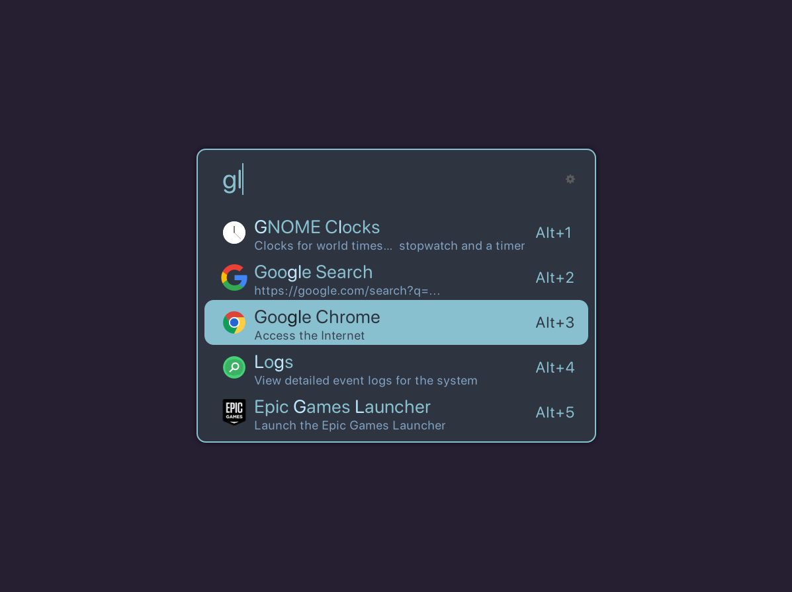

# [Ulauncher](https://ulauncher.io) Nord

Ulauncher theme based on Nord color palette.
Reference: https://www.nordtheme.com/

## Installation

* Create ulauncher themes directory, if not present:

```
mkdir -p ~/.config/ulauncher/user-themes
```

* Clone the repo in that folder:

```
git clone https://github.com/LucianoBigliazzi/ulauncher-nord.git \
~/.config/ulauncher/user-themes/ulauncher-nord
```

## Preview


